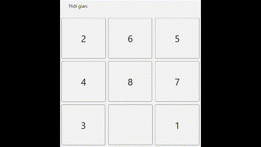
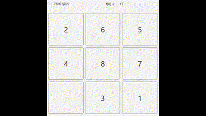
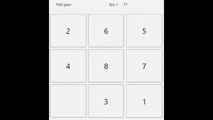
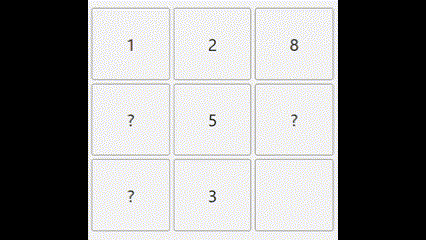
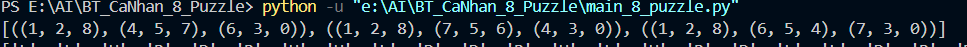
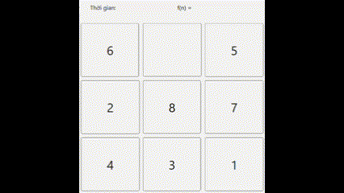
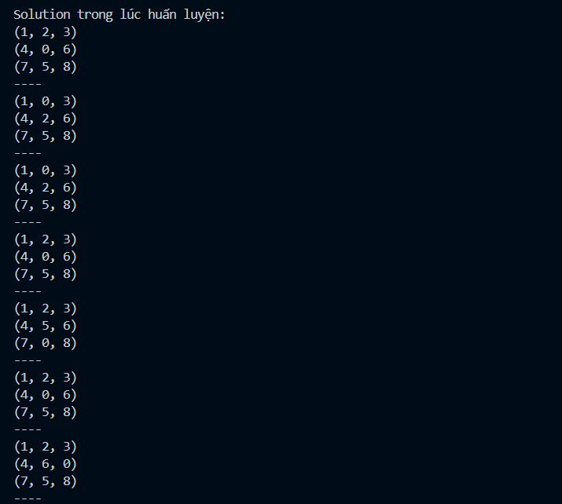
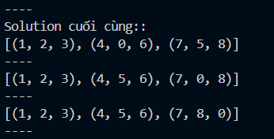
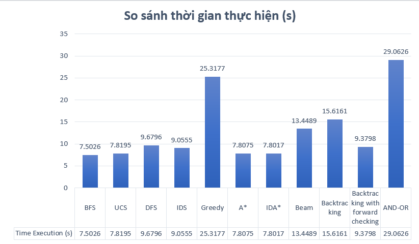

# BÁO CÁO BÀI TẬP CÁ NHÂN: TRÒ CHƠI 8-PUZZLE

**Môn:** Trí Tuệ Nhân Tạo  
**Giảng viên hướng dẫn:** TS. Phan Thị Huyền Trang  
**Sinh viên thực hiện:** Võ Minh Xuân Kiều - 23110245

## Mục lục
- [Mục tiêu](#mục-tiêu)
- [Nội dung](#nội-dung)
  - [Nhóm thuật toán tìm kiếm không có thông tin](#nhóm-thuật-toán-tìm-kiếm-không-có-thông-tin-bfs-dfs-ucs-ids)
  - [Nhóm thuật toán tìm kiếm có thông tin](#nhóm-thuật-toán-tìm-kiếm-có-thông-tin-greedy-ida-a)
  - [Nhóm thuật toán tìm kiếm cục bộ](#nhóm-thuật-toán-tìm-kiếm-cục-bộ-beam-simulated-annealing-genetic-hill-climbing)
  - [Môi trường phức tạp](#môi-trường-phức-tạp-and-or-sensorless-partial-observation)
  - [Nhóm thuật toán có ràng buộc](#nhóm-thuật-toán-có-ràng-buộc-backtracking-forward-checking-min-conflicts)
  - [Nhóm học tăng cường](#nhóm-học-tăng-cường-q-learning)
- [So sánh độ hiệu quả các thuật toán](#so-sánh-độ-hiệu-quả-các-thuật-toán)
- [Kết luận](#kết-luận)

## Mục tiêu

Bài tập này nhằm mục tiêu tìm hiểu và khám phá lĩnh vực thuật toán tìm kiếm, từ các phương pháp không sử dụng thông tin heuristic cho đến những kỹ thuật khai thác tri thức cụ thể của bài toán. Bên cạnh đó, nội dung cũng bao gồm các chiến lược tìm kiếm cục bộ, các phương pháp giải bài toán trong điều kiện có ràng buộc, cũng như các mô hình hoạt động trong môi trường phức tạp. Trọng tâm của bài tập này là triển khai và thử nghiệm các thuật toán này trên bài toán kinh điển 8-Puzzle, đồng thời trực quan hóa quá trình tìm kiếm nhằm làm nổi bật đặc trưng của từng thuật toán. Sau đó đưa ra các phân tích, đánh giá thông qua các chỉ số định lượng như số nút sinh ra, số nút duyệt, thời gian giải và độ dài lời giải.

## Nội dung

### Nhóm thuật toán tìm kiếm không có thông tin (BFS, DFS, UCS, IDS)

#### Thành phần chính của bài toán bao gồm:

  Trạng thái ban đầu: ma trận 3x3 với các số từ 0-8.

  Tập hành động: lên, xuống, trái, phải (di chuyển ô trống).

  Hàm xác định ô trống (ô có giá trị 0)

  Hàm tạo trạng thái mới sau khi áp dụng hành động.

  Kiểm tra mục tiêu: so sánh trạng thái hiện tại với trạng thái đích.

  Chi phí: mỗi bước có chi phí bằng nhau (bằng 1).

Đối với bài toán này, giải pháp (solution) là một chuỗi các trạng thái từ trạng thái ban đầu đến trạng thái mục tiêu được lưu dưới dạng danh sách lồng danh sách.

Thuật toán sẽ bắt đầu từ trạng thái ban đầu và lần lượt mở rộng các trạng thái tiếp theo dựa trên các hành động hợp lệ (di chuyển ô trống).

Không sử dụng bất kỳ thông tin nào về khoảng cách đến trạng thái đích, mà chỉ dựa vào thứ tự duyệt hoặc chi phí hành động:

  BFS duyệt theo mức độ, đảm bảo tìm lời giải ngắn nhất theo số bước. Độ phức tạp O(b^d), với b là độ rộng của cây và d là độ sâu của cây tìm kiếm.

  DFS đi sâu vào nhánh trước, nhanh nhưng dễ lặp. Độ phức tạp O(b^d).

  UCS giống BFS nhưng xét chi phí thực của từng hành động. Ưu tiên các nhánh có chi phí thấp trước. Độ phức tạp: O(b^d).

  IDS kết hợp DFS và BFS bằng cách duyệt sâu dần theo mức giới hạn và tăng dần độ sâu cho đến khi tìm thấy giải pháp. Độ phức tạp: O(b^d), nhưng ít tốn bộ nhớ hơn so với BFS.

#### Hình ảnh gif của từng thuật toán

    

  BFS         

  

  DFS

   

  IDS     

   

  UCS

#### Nhận xét

Nhóm thuật toán này không sử dụng thông tin mục tiêu nên thường tốn nhiều thời gian và tài nguyên để duyệt toàn bộ không gian trạng thái. Trong 8-Puzzle, BFS có thể đảm bảo tìm được lời giải ngắn nhất nhưng tiêu tốn rất nhiều bộ nhớ. DFS tiết kiệm bộ nhớ hơn nhưng dễ rơi vào vòng lặp và không đảm bảo tối ưu. UCS phù hợp khi các bước có chi phí khác nhau. IDS là sự cân bằng giữa BFS và DFS. Tuy hiệu quả tổng thể không cao, nhóm này giúp hiểu rõ cơ bản của tìm kiếm trạng thái.

### Nhóm thuật toán tìm kiếm có thông tin (Greedy, IDA*, A*)

#### Thành phần chính của bài toán bao gồm:

  Trạng thái ban đầu: ma trận 3x3 với các số từ 0-8.

  Tập hành động: lên, xuống, trái, phải (di chuyển ô trống).

  Hàm xác định ô trống (ô có giá trị 0).

  Hàm tạo trạng thái mới sau khi áp dụng hành động.

  Kiểm tra mục tiêu: so sánh trạng thái hiện tại với trạng thái đích.

  Chi phí các bước đi (thường là bằng 1).

  Hàm heuristic (h(n)): Tính toán chi phí từ trạng thái hiện tại đến trạng thái mục tiêu (ví dụ: ô sai vị trí, khoảng cách Manhattan).

Đối với bài toán này, giải pháp (solution) là một chuỗi các trạng thái từ trạng thái ban đầu đến trạng thái mục tiêu được lưu dưới dạng danh sách lồng danh sách.

Áp dụng hàm heuristic h(n) để ước lượng chi phí từ trạng thái hiện tại đến trạng thái đích, giúp thuật toán ưu tiên mở rộng những trạng thái có khả năng tốt hơn.

Kết hợp với chi phí thực để chọn đường đi tối ưu:

  Greedy chỉ dựa vào h(n) nên nhanh nhưng có thể lệch hướng. Độ phức tạp: O(b^d).

  A* kết hợp chi phí thực g(n) và ước lượng h(n) - khoảng cách so với mục tiêu theo công thức f(n) = g(n) + h(n) để đảm bảo giải tối ưu. Độ phức tạp: O(b^d).

  IDA* sử dụng cách tiếp cận lặp sâu theo giới hạn f(n), giúp tiết kiệm bộ nhớ. Độ phức tạp: O(b^d).

#### Hình ảnh gif của từng thuật toán

    

  Greedy Search					
  
                                              

  A* 

				    
  IDA*

#### Nhận xét

Nhóm này tận dụng thông tin heuristic nên hoạt động hiệu quả hơn so với nhóm không thông tin. A* nổi bật vì vừa nhanh, vừa tìm được lời giải tối ưu nếu heuristic phù hợp. Greedy đơn giản, nhanh nhưng không đảm bảo tối ưu về đường đi. IDA* là biến thể tiết kiệm bộ nhớ của A*, thích hợp cho không gian lớn như 8-Puzzle. Trong thực tế, nếu thiết kế được hàm heuristic tốt, nhóm này là lựa chọn ưu tiên hàng đầu.

### Nhóm thuật toán tìm kiếm cục bộ (Beam, Simulated Annealing, Genetic, Hill Climbing, Steepest AHC, Stochastic HC)

#### Thành phần chính của bài toán bao gồm:

  Trạng thái ban đầu: ma trận 3x3 với các số từ 0-8.

  Tập hành động: lên, xuống, trái, phải (di chuyển ô trống).

  Hàm xác định ô trống (ô có giá trị 0).

  Hàm tạo trạng thái mới sau khi áp dụng hành động.

  Kiểm tra mục tiêu: so sánh trạng thái hiện tại với trạng thái đích.

  Chi phí các bước đi (thường là bằng 1).

  Hàm heuristic (h(n)): Tính toán chi phí từ trạng thái hiện tại đến trạng thái mục tiêu (ví dụ: ô sai vị trí, khoảng cách Manhattan).

Đối với bài toán này, giải pháp (solution) là một chuỗi các trạng thái từ trạng thái ban đầu đến trạng thái mục tiêu được lưu dưới dạng danh sách lồng danh sách.

Xuất phát từ trạng thái ban đầu, thuật toán cải tiến dần trạng thái hiện tại dựa trên đánh giá chất lượng (số lượng ô đúng vị trí, khoảng cách Manhattan,...).

Không duyệt toàn bộ không gian mà chỉ tập trung vào trạng thái “tốt hơn”:

  Hill Climbing chọn trạng thái tốt hơn liền kề. Độ phức tạp: O(b^d).

  Stochastic HC chọn ngẫu nhiên trong số các lựa chọn tốt. Độ phức tạp O(b^d).

  Steepest Ascent HC chọn trạng thái cải thiện tốt nhất. Độ phức tạp: O(b^d).

  Simulated Annealing cho phép đi tới trạng thái tệ hơn với xác suất giảm dần để thoát cực trị cục bộ. Độ phức tạp: O(b^d).

  Beam Search mở rộng nhiều nhánh song song, giữ lại k trạng thái tốt nhất tại mỗi bước. Độ phức tạp: O(b^k), với k là số lượng beam.

  Genetic Algorithm tạo ra quần thể lời giải và tiến hóa dần thông qua lai ghép và đột biến. Độ phức tạp: O(b^d).

#### Hình ảnh gif của từng thuật toán

Nhóm này chỉ có Beam Search giải được nhờ vào chạy song song, các thuật toán còn lại đều bị kẹt hoặc thời gian giải quá lâu dẫn đến hệ thống bị đứng. Simulated Annealing và Genetic Algorithm khi đổi trạng thái đầu đơn giản hơn thì có thể giải ra. 

					 
  Beam

#### Nhận xét

Các thuật toán này không khám phá toàn bộ không gian, mà chỉ tìm lời giải bằng cách cải thiện trạng thái hiện tại. Trong 8-Puzzle, chúng cho kết quả nhanh nhưng dễ bị kẹt ở cực trị cục bộ. Simulated Annealing và Genetic Algorithm cải thiện điều đó bằng xác suất và đa dạng hóa. Beam Search duy trì nhiều hướng đi song song, còn các biến thể Hill Climbing thích hợp cho bài toán cần tính toán nhanh. Đây là nhóm thuật toán đáng cân nhắc khi cần lời giải nhanh mà không cần đảm bảo có ra được lời giải hay không.

### Môi trường phức tạp (And-Or, Searching with no Observation, Searching with Partial Observation)

#### Thành phần chính của bài toán bao gồm:

  Tập hợp các trạng thái khả dĩ thay vì một trạng thái cụ thể (belief state).

  Không gian tìm kiếm là không chắc chắn hoặc không hoàn toàn quan sát được: Không phải mọi trạng thái hoặc hành động đều quan sát được kết quả rõ ràng.

  Hành động có thể dẫn đến nhiều trạng thái: Một hành động không đảm bảo kết quả duy nhất, cần lập kế hoạch ứng phó với nhiều khả năng xảy ra.

  Cây tìm kiếm phức tạp: Có thể bao gồm các nút AND (phải thỏa mãn tất cả kết quả con) và OR (chọn một trong nhiều khả năng).

Giải pháp (solution) là một chuỗi các trạng thái từ trạng thái ban đầu đến trạng thái mục tiêu được lưu dưới dạng danh sách lồng danh sách.

Với bài toán 8-Puzzle khi trạng thái ban đầu không rõ ràng hoặc bị hạn chế quan sát, cần lập kế hoạch cho tập hợp các trạng thái khả dĩ (belief states).

Thuật toán phải tìm ra một chuỗi hành động có thể áp dụng cho mọi trạng thái ban đầu để đảm bảo đạt được mục tiêu:

  Sensorless Search tìm chuỗi hành động làm giảm tập trạng thái về một điểm xác định. Độ phức tạp: O(b^d).

  AND-OR Graph sử dụng cây kế hoạch với các nhánh điều kiện (AND để kết hợp hành động, OR cho các phản ứng có thể xảy ra). Độ phức tạp: O(b^d).

  Partial Observation áp dụng suy luận logic để cập nhật trạng thái dựa trên thông tin quan sát hạn chế. Độ phức tạp: O(b^d).

#### Hình ảnh gif của từng thuật toán

	And-Or Search

	Partial Observation with A*

	Belief sinh ra từ trạng thái đầu bị thiếu 

	Sensorless with A*

#### Nhận xét

Nhóm này phù hợp hợp khi không có đầy đủ thông tin hoặc trạng thái ban đầu chưa được xác định rõ ràng. Mặc dù yêu cầu xử lý phức tạp và lời giải thường không đơn giản, nhưng lại giúp hệ thống thích nghi linh hoạt hơn và mô phỏng hiệu quả các tình huống thực tế, chẳng hạn như khi không biết chính xác vị trí khởi đầu hoặc không thể quan sát toàn bộ trạng thái hiện tại.

### Nhóm thuật toán có ràng buộc (Backtracking, Backtracking with forward checking)

#### Thành phần chính của bài toán bao gồm:

  Trạng thái ban đầu: ma trận 3x3 với các số từ 0-8.

  Tập hành động: lên, xuống, trái, phải (di chuyển ô trống).

  Hàm xác định ô trống (ô có giá trị 0)

  Hàm tạo trạng thái mới sau khi áp dụng hành động.

  Kiểm tra mục tiêu: so sánh trạng thái hiện tại với trạng thái đích.

  Chi phí các bước đi (thường là bằng 1).

  Hàm heuristic (h(n)): Tính toán chi phí từ trạng thái hiện tại đến trạng thái mục tiêu (ví dụ: ô sai vị trí, khoảng cách Manhattan).

Đối với bài toán này, giải pháp (solution) là một chuỗi các trạng thái từ trạng thái ban đầu đến trạng thái mục tiêu được lưu dưới dạng danh sách lồng danh sách.

Thuật toán kiểm tra từng hành động hợp lệ dựa trên các ràng buộc đặt ra (ví dụ: không được quay lại trạng thái trước, không vượt quá số bước nhất định,...).

Nếu không tìm được hành động thỏa mãn, thuật toán sẽ quay lui (backtrack) để thử nhánh khác:

  Backtracking đơn thuần kiểm tra ràng buộc khi tạo ra trạng thái mới. Độ phức tạp: O(b^d).

  Forward Checking kiểm tra trước ràng buộc có thể bị vi phạm trong các bước tiếp theo, giúp loại bỏ sớm các nhánh sai. Độ phức tạp: O(b^d).

  Min-Conflicts bắt đầu từ một gán ngẫu nhiên và liên tục thay đổi giá trị của biến gây xung đột sao cho tổng số xung đột giảm xuống. Độ phức tạp O(b^d).

#### Hình ảnh gif của từng thuật toán

    

  Backtracking

  Backtracking with forward checking

Min Conflicts khi áp dụng vào trạng thái đầu này thì sẽ giải rất lâu với số lượng max steps rất lớn, vì vậy sẽ áp dụng vào trạng thái đầu đơn giản hơn để có thể giải ra. 

#### Nhận xét

Nhóm này hiệu quả với 8-Puzzle trong các biến thể có điều kiện cụ thể như giới hạn số lần di chuyển hoặc tránh lặp trạng thái. Backtracking cho giải pháp đơn giản nhưng dễ tốn thời gian nếu không kiểm soát ràng buộc hiệu quả. Forward Checking hỗ trợ phát hiện sớm xung đột, giúp tiết kiệm tài nguyên. Dù không phổ biến cho 8-Puzzle tiêu chuẩn, nhóm này có thể rất hữu ích nếu bài toán mở rộng theo hướng có thêm quy tắc hoặc điều kiện nghiêm ngặ

### Nhóm học tăng cường (Q-Learning)

#### Thành phần chính của bài toán bao gồm:

  Trạng thái ban đầu: ma trận 3x3 với các số từ 0-8.

  Tập hành động: lên, xuống, trái, phải (di chuyển ô trống).

  Hàm xác định ô trống (ô có giá trị 0)

  Hàm tạo trạng thái mới sau khi áp dụng hành động.

  Kiểm tra mục tiêu: so sánh trạng thái hiện tại với trạng thái đích.

  Chính sách (policy): Chiến lược mà tác nhân sử dụng để chọn hành tại mỗi trạng thái.

  Hàm giá trị: Đánh giá chất lượng của hành động trong một trạng thái cụ thể. Được thể hiện thông qua bảng Q(s, a) – dự đoán giá trị kỳ vọng khi thực hiện hành động a ở trạng thái s, rồi tiếp tục theo chính sách tốt nhất.

  Tác nhân (agent): Là người hoặc thuật toán thực hiện các hành động trong môi trường để học ra chính sách tối ưu dựa trên kinh nghiệm.

#### Giải pháp (solution) cho bài toán:

  Tác nhân bắt đầu từ một trạng thái bất kỳ và thực hiện các hành động ngẫu nhiên hoặc dựa trên chính sách hiện tại.
  Sau mỗi bước đi, tác nhân cập nhật bảng Q theo công thức:
    Q(s, a) ← Q(s, a) + α[r + γ * max(Q(s’, a’)) - Q(s, a)]
  Trong đó:
  α: tốc độ học
  γ: hệ số chiết khấu
  r: phần thưởng nhận được
  s’: trạng thái mới

  Qua nhiều lần thử nghiệm (episode), bảng Q hội tụ dần và tác nhân học được chiến lược tối ưu để giải 8-Puzzle một cách hiệu quả. Độc phức tạp O(b^d), phụ thuộc vào việc cập nhật Q-table.

#### Hình ảnh gif của từng thuật toán

Thuật toán tốn rất nhiều thời gian để học và tìm ra lời giải tốt nhất, vì vậy khi áp dụng lên giao diện sẽ khiến hệ thống bị đơ, nên không lưu lại được bước chạy của thuật toán. 

Thử với trạng thái đầu đơn giản hơn và xuất kết quả trên terminal

                

#### Nhận xét

Q-Learning tiềm năng khi cần học từ trải nghiệm, không dựa vào mô hình sẵn có. Với 8-Puzzle, thuật toán học sẽ rất chậm do cần nhiều lần thử với số lượng trạng thái khổng lồ để có thể đạt được chiến lược hiệu quả nhất, áp dụng vào giải quyết bài toán. 

### So sánh độ hiệu quả các thuật toán

  Biểu đồ so sánh

Biểu đồ trên so sánh thời gian thực hiện của các thuật toán giải bài toán 8-Puzzle. Kết quả cho thấy các thuật toán A* (7.8075s), IDA* (7.8017s) và BFS (7.5026s) có hiệu suất cao nhất, nhờ khả năng tìm kiếm có định hướng và đảm bảo tìm ra lời giải tối ưu. Greedy (25.3177s) và AND-OR (29.0626s) là hai thuật toán chậm nhất, do dễ bị lạc hướng khi phụ thuộc hoàn toàn vào heuristic hoặc phải xử lý nhiều nhánh trong môi trường không xác định. Các thuật toán tìm kiếm truyền thống như UCS, DFS, IDS có thời gian trung bình, trong đó DFS thường bị chậm do dễ đi sâu vào nhánh sai. Về phía các thuật toán ràng buộc, Backtracking mất nhiều thời gian (15.6161s), nhưng khi kết hợp với Forward Checking (9.3798s), thời gian cải thiện đáng kể nhờ loại bỏ sớm các nhánh không hợp lệ. Beam Search cũng cho kết quả khá (13.4489s) nhờ chỉ mở rộng các nhánh tốt nhất, nhưng vẫn có nguy cơ bỏ lỡ lời giải. Nhìn chung, các thuật toán có hướng dẫn tốt và kiểm soát mở rộng hiệu quả như A*, IDA* là lựa chọn tối ưu cho bài toán này.

## Kết luận
Việc áp dụng nhiều nhóm thuật toán tìm kiếm vào bài toán 8-Puzzle giúp phân tích và đánh giá hiệu quả từng chiến lược trong nhiều điều kiện thông tin khác nhau. Mỗi nhóm có ưu nhược riêng và phù hợp với bối cảnh cụ thể. Bài toán không chỉ giúp củng cố kiến thức mà còn phát triển kỹ năng phân tích và chọn lựa giải pháp hiệu quả trong trí tuệ nhân tạo và robot học.
